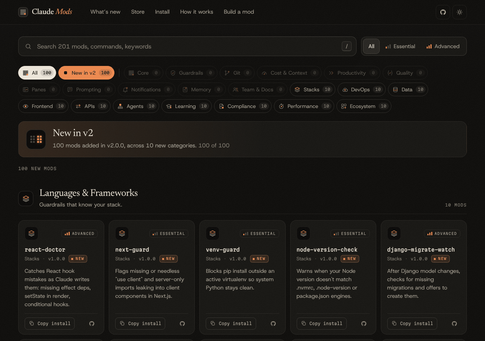

<p align="center">
  <a href="https://plagemes.github.io/claude-mods/">
    <picture>
      <source media="(prefers-color-scheme: dark)" srcset="assets/banner-dark.svg">
      <source media="(prefers-color-scheme: light)" srcset="assets/banner-light.svg">
      
    </picture>
  </a>
</p>

<p align="center">
  <a href="#catalog"></a>
  <a href="#whats-new-in-v2"></a>
  <a href="LICENSE"></a>
  <a href="#quick-start"></a>
  <a href="https://plagemes.github.io/claude-mods/"></a>
</p>

<p align="center">
  <b>Make Claude Code yours, one hook at a time.</b><br>
  <a href="https://plagemes.github.io/claude-mods/">Browse the store</a> &nbsp;&middot;&nbsp;
  <a href="#whats-new-in-v2">What&rsquo;s new</a> &nbsp;&middot;&nbsp;
  <a href="#quick-start">Quick start</a> &nbsp;&middot;&nbsp;
  <a href="#catalog">Catalog</a> &nbsp;&middot;&nbsp;
  <a href="CONTRIBUTING.md">Build a mod</a>
</p>

<br>

**Claude Mods** is a curated collection of more than 200 open-source mods for Claude Code: small plugins of function hooks that add guardrails, live panes, status lines, agent controls and stack-aware checks to the terminal and the desktop Code tab. Install one store, then browse, install and update everything else without leaving Claude Code. Each mod does one thing, works with zero configuration, and is a folder of plain TypeScript you can read in a minute.

## What's new in v2

**v2.0.0 adds a second shelf to the rack: 100 new mods in 10 new categories.** They cover your stack, your database and your cloud, and they let you scope, queue and supervise Claude itself. The store and the two install commands stay the same, and every v1 mod keeps its name and install command. Browse them with `/mods`, or turn on the **New** filter in the [web store](https://plagemes.github.io/claude-mods/#new).

| New category | What it covers | Try first |
| --- | --- | --- |
| **Languages & Frameworks** | Guardrails that know your stack. | [react-doctor](mods/react-doctor), [venv-guard](mods/venv-guard) |
| **DevOps & Cloud** | Containers, CI, infra and deploys without surprises. | [k8s-dry-run](mods/k8s-dry-run), [terraform-plan-pane](mods/terraform-plan-pane) |
| **Databases & Data** | Safer queries, schemas and test data. | [backup-before-migrate](mods/backup-before-migrate), [sql-safety](mods/sql-safety) |
| **Frontend & Accessibility** | Pixels, bundles and a11y, checked as you go. | [screenshot-check](mods/screenshot-check), [a11y-guard](mods/a11y-guard) |
| **APIs & Network** | Talk to the web on your terms. | [offline-mode](mods/offline-mode), [http-client](mods/http-client) |
| **Agents & Orchestration** | Scope, queue and supervise Claude's work. | [scope-lock](mods/scope-lock), [task-queue](mods/task-queue) |
| **Learning & Onboarding** | Understand the code, not just ship it. | [explain-diff](mods/explain-diff), [onboarding-tour](mods/onboarding-tour) |
| **Privacy & Compliance** | Licenses, personal data and audit trails. | [license-checker](mods/license-checker), [audit-trail](mods/audit-trail) |
| **Performance & Reliability** | Fast, stable and regression-free. | [regression-guard](mods/regression-guard), [flaky-detector](mods/flaky-detector) |
| **Mod Ecosystem** | Make, manage and personalise your mods. | [mod-maker](mods/mod-maker), [mod-profiles](mods/mod-profiles) |

## Quick start

**1. Install the mod store**

```text
/plugin install mod-store --marketplace plagemes/claude-mods
```

**2. Open it**

```text
/mods
```

Search, filter by category, then install, update or uninstall from a pane inside Claude Code. The store caches the catalog, so it still works offline.

**Prefer one mod at a time?** Install any mod from the [catalog](#catalog) directly:

```text
/plugin install <mod> --marketplace plagemes/claude-mods
```

> [!NOTE]
> Claude Mods needs Claude Code **2.1.292** or later. Run `/reload-plugins` after installing or updating a mod.

<p align="center">
  <a href="https://plagemes.github.io/claude-mods/#store">
    <picture>
      <source media="(prefers-color-scheme: dark)" srcset="assets/store-dark.png">
      <source media="(prefers-color-scheme: light)" srcset="assets/store-light.png">
      
    </picture>
  </a>
  <br>
  <sub>The same catalog, searchable on the web at <a href="https://plagemes.github.io/claude-mods/">plagemes.github.io/claude-mods</a>. Every card has a one-click install command.</sub>
</p>

## Highlights

<sub>The middle column is new in v2.</sub>

<table>
  <tr>
    <td width="33%" valign="top">
      <b><a href="mods/mod-store">mod-store</a></b><br>
      <sub>CORE</sub><br>
      An app store inside your terminal. Browse, install and update every mod with <code>/mods</code>.
    </td>
    <td width="33%" valign="top">
      <b><a href="mods/scope-lock">scope-lock</a></b><br>
      <sub>AGENTS &amp; ORCHESTRATION &middot; NEW IN V2</sub><br>
      Lock Claude to the files you name with <code>/scope</code>. Edits anywhere else are blocked.
    </td>
    <td width="33%" valign="top">
      <b><a href="mods/secret-shield">secret-shield</a></b><br>
      <sub>GUARDRAILS</sub><br>
      Refuses any edit that would write an API key, token or private key to disk.
    </td>
  </tr>
  <tr>
    <td width="33%" valign="top">
      <b><a href="mods/auto-checkpoint">auto-checkpoint</a></b><br>
      <sub>GIT</sub><br>
      Snapshots your work tree before every editing turn. <code>/rollback</code> to any of them.
    </td>
    <td width="33%" valign="top">
      <b><a href="mods/screenshot-check">screenshot-check</a></b><br>
      <sub>FRONTEND &amp; ACCESSIBILITY &middot; NEW IN V2</sub><br>
      After a UI edit, takes a Playwright screenshot of the page and shows it to Claude.
    </td>
    <td width="33%" valign="top">
      <b><a href="mods/cost-meter">cost-meter</a></b><br>
      <sub>COST &amp; CONTEXT</sub><br>
      A live session cost estimate in your status line, from real token usage.
    </td>
  </tr>
  <tr>
    <td width="33%" valign="top">
      <b><a href="mods/tool-timeline">tool-timeline</a></b><br>
      <sub>PANES</sub><br>
      A timeline pane of every tool call, with duration, status and a summary of its input.
    </td>
    <td width="33%" valign="top">
      <b><a href="mods/mod-maker">mod-maker</a></b><br>
      <sub>MOD ECOSYSTEM &middot; NEW IN V2</sub><br>
      <code>/new-mod</code> scaffolds a mod with manifest, hooks, test and README, ready to fill in.
    </td>
    <td width="33%" valign="top">
      <b><a href="mods/done-chime">done-chime</a></b><br>
      <sub>NOTIFICATIONS</sub><br>
      A soft chime when a long turn finishes, so you can look away while Claude works.
    </td>
  </tr>
</table>

## Catalog

<sub>Every mod, by category. Commands are listed where a mod adds them. Search the same list, or filter it to what is new, on the <a href="https://plagemes.github.io/claude-mods/#store">web store</a>.</sub>

**Shelf 1 (v1):** [Core](#core) &middot; [Guardrails](#security--guardrails) &middot; [Git](#git--versioning) &middot; [Cost & Context](#cost-tokens--context) &middot; [Productivity](#productivity) &middot; [Quality](#code-quality--tests) &middot; [Panes](#panes--dashboards) &middot; [Prompting](#prompt--system-prompt) &middot; [Notifications](#notifications--audio) &middot; [Memory](#memory--knowledge) &middot; [Team & Docs](#team--docs)<br>
**Shelf 2 (new in v2):** [Stacks](#languages--frameworks) &middot; [DevOps](#devops--cloud) &middot; [Data](#databases--data) &middot; [Frontend](#frontend--accessibility) &middot; [APIs](#apis--network) &middot; [Agents](#agents--orchestration) &middot; [Learning](#learning--onboarding) &middot; [Compliance](#privacy--compliance) &middot; [Performance](#performance--reliability) &middot; [Ecosystem](#mod-ecosystem)

<!-- CATALOG:START -->

### Core
<sub>The mod store and essentials. &middot; 1 mod</sub>

<details open>
<summary>Show the 1 mod</summary>
<br>

| Mod | What it does | Commands |
| --- | --- | --- |
| [**mod-store**](mods/mod-store) | An in-terminal app store: browse, search, install and update every Claude Mod from GitHub. | `/mods` |

</details>

### Security & Guardrails
<sub>Stop dangerous actions before they happen. &middot; 10 mods</sub>

<details>
<summary>Show the 10 mods</summary>
<br>

| Mod | What it does | Commands |
| --- | --- | --- |
| [**secret-shield**](mods/secret-shield) | Blocks edits and writes that would commit API keys, tokens or private keys. | — |
| [**env-guard**](mods/env-guard) | Protects .env files, SSH keys and credential stores from being read or modified. | — |
| [**rm-rf-guard**](mods/rm-rf-guard) | Blocks catastrophic shell commands like rm -rf /, mkfs, dd to disks and chmod -R 777. | — |
| [**force-push-guard**](mods/force-push-guard) | Forbids force-pushing to protected branches and suggests --force-with-lease. | — |
| [**prod-guard**](mods/prod-guard) | Stops production-affecting commands (terraform apply, kubectl on prod, DROP TABLE) unless explicitly allowed. | — |
| [**redactor**](mods/redactor) | Masks secrets and personal data in tool results before the model ever reads them. | — |
| [**path-jail**](mods/path-jail) | Allows writes only inside the project root, resolving symlinks and .. tricks. | `/jail` |
| [**curl-pipe-guard**](mods/curl-pipe-guard) | Blocks piping downloaded scripts straight into a shell. | — |
| [**dependency-sentinel**](mods/dependency-sentinel) | Flags typosquatted or brand-new packages before npm, pip or cargo installs them. | — |
| [**lockfile-guard**](mods/lockfile-guard) | Prevents hand-editing lockfiles; they must change through the package manager. | — |

</details>

### Git & Versioning
<sub>Branches, commits and PRs without friction. &middot; 10 mods</sub>

<details>
<summary>Show the 10 mods</summary>
<br>

| Mod | What it does | Commands |
| --- | --- | --- |
| [**git-status-line**](mods/git-status-line) | Shows the current branch, ahead/behind and dirty file count in the status line. | — |
| [**auto-checkpoint**](mods/auto-checkpoint) | Snapshots your work tree before every editing turn and lets you /rollback to any checkpoint. | `/checkpoints` `/rollback` |
| [**commit-composer**](mods/commit-composer) | /commit writes a Conventional Commit message from your staged diff and commits it. | `/commit` |
| [**branch-namer**](mods/branch-namer) | /git-branch creates a well-named git branch from a short task description. | `/git-branch` |
| [**main-branch-warn**](mods/main-branch-warn) | Warns you the moment Claude starts editing files directly on main or master. | — |
| [**diff-pane**](mods/diff-pane) | A live pane listing changed files with +/- line counts, updated after every edit. | `/changes` |
| [**pr-describer**](mods/pr-describer) | /pr-desc drafts a pull request title and description from your branch diff. | `/pr-desc` |
| [**conflict-helper**](mods/conflict-helper) | Detects merge-conflict markers and walks you through resolving each one. | `/conflicts` |
| [**co-author-stamp**](mods/co-author-stamp) | Adds configurable Co-authored-by trailers to commits Claude makes. | — |
| [**gitignore-guard**](mods/gitignore-guard) | Warns before node_modules, build output, OS junk or huge files get staged. | — |

</details>

### Cost, Tokens & Context
<sub>Know what every turn costs and keep context lean. &middot; 10 mods</sub>

<details>
<summary>Show the 10 mods</summary>
<br>

| Mod | What it does | Commands |
| --- | --- | --- |
| [**cost-meter**](mods/cost-meter) | Live session cost estimate in the status line, from real token usage. | `/cost-reset` |
| [**token-budget**](mods/token-budget) | Set a token or dollar budget per session; get warned at 80% and stopped at 100%. | `/budget` |
| [**context-gauge**](mods/context-gauge) | A slim band above the prompt showing how full the context window is. | `/context-gauge` |
| [**cache-hit-meter**](mods/cache-hit-meter) | Shows what share of input tokens came from the prompt cache. | — |
| [**turn-timer**](mods/turn-timer) | Times every turn and tells you when one runs long. | — |
| [**big-read-guard**](mods/big-read-guard) | Stops full reads of huge files and nudges toward offset/limit or grep. | — |
| [**output-trimmer**](mods/output-trimmer) | Trims huge command outputs to head, tail and error lines before they flood the context. | — |
| [**daily-spend**](mods/daily-spend) | Tracks spend per day and week across sessions with a /spend report. | `/spend` |
| [**model-advisor**](mods/model-advisor) | Suggests a cheaper model when your prompt is simple, and a stronger one when it is hard. | `/model-advisor` |
| [**compact-coach**](mods/compact-coach) | Suggests /compact at natural breakpoints, before the context gets tight. | — |

</details>

### Productivity
<sub>Shortcuts, panes and timers for a faster flow. &middot; 10 mods</sub>

<details>
<summary>Show the 10 mods</summary>
<br>

| Mod | What it does | Commands |
| --- | --- | --- |
| [**quote-selection**](mods/quote-selection) | /quote pastes your mouse selection into the prompt as a Markdown quote. | `/quote` `/quote-code` |
| [**prompt-snippets**](mods/prompt-snippets) | Type :review:, :tests: or your own shortcodes and they expand into full prompts. | `/snippets` `/snippet-add` `/snippet-remove` |
| [**todo-pane**](mods/todo-pane) | A live pane of Claude's current task list with progress. | `/todos` |
| [**focus-timer**](mods/focus-timer) | A Pomodoro timer in the status line with focus and break cycles. | `/pomodoro` |
| [**scratchpad**](mods/scratchpad) | A persistent per-project notes pane you can type into without leaving Claude Code. | `/notes` `/note` |
| [**recent-files**](mods/recent-files) | /recent lists the files read and edited in this session, newest first. | `/recent` |
| [**copy-last**](mods/copy-last) | /copy-last copies Claude's last answer (or its last code block) to the clipboard. | `/copy-last` `/copy-code` |
| [**prompt-history**](mods/prompt-history) | /history searches every prompt you have sent across sessions and reuses one. | `/history` |
| [**quick-commands**](mods/quick-commands) | Short aliases like /t, /l and /b that run your test, lint and build commands. | `/t` `/l` `/b` `/tc` |
| [**idle-nudge**](mods/idle-nudge) | Reminds you about uncommitted changes after a stretch of inactivity. | — |

</details>

### Code Quality & Tests
<sub>Formatting, linting and tests on autopilot. &middot; 10 mods</sub>

<details>
<summary>Show the 10 mods</summary>
<br>

| Mod | What it does | Commands |
| --- | --- | --- |
| [**auto-format**](mods/auto-format) | Formats every file Claude edits with the right formatter for its language. | — |
| [**lint-on-save**](mods/lint-on-save) | Runs the linter on each edited file and hands the errors straight back to Claude. | — |
| [**test-watch**](mods/test-watch) | Runs the tests related to what changed and shows pass/fail in the status line. | — |
| [**typecheck-gate**](mods/typecheck-gate) | Type-checks the project at the end of every editing turn so errors never slip by. | — |
| [**no-skip-tests**](mods/no-skip-tests) | Blocks Claude from silencing tests with .skip, .only, xit or skip markers. | — |
| [**todo-tracker**](mods/todo-tracker) | Notices every TODO, FIXME and HACK Claude adds and lists them at turn end. | `/todos-added` |
| [**debug-catcher**](mods/debug-catcher) | Warns when console.log, print, debugger or dbg! statements are left in code. | — |
| [**no-any**](mods/no-any) | Flags new any types, @ts-ignore and eslint-disable comments as Claude writes them. | — |
| [**file-size-watch**](mods/file-size-watch) | Warns when an edited file grows past a size that hurts readability. | — |
| [**test-first**](mods/test-first) | A TDD mode: no production code changes until a test has been written or changed. | — |

</details>

### Panes & Dashboards
<sub>See what Claude is doing, live. &middot; 10 mods</sub>

<details>
<summary>Show the 10 mods</summary>
<br>

| Mod | What it does | Commands |
| --- | --- | --- |
| [**tool-timeline**](mods/tool-timeline) | A timeline pane of every tool call with duration, status and input summary. | — |
| [**files-touched**](mods/files-touched) | A pane of every file read, edited or created in the session, with counts. | — |
| [**session-stats**](mods/session-stats) | /session-stats shows a dashboard of turns, tools, tokens, cost, duration and files. | `/session-stats` |
| [**subagent-monitor**](mods/subagent-monitor) | Watch running subagents live: type, status, duration and last activity. | — |
| [**error-feed**](mods/error-feed) | Collects every failed command and tool error in one pane. | — |
| [**activity-heatmap**](mods/activity-heatmap) | A heat map of when you use Claude Code, by hour and weekday. | — |
| [**bash-history**](mods/bash-history) | /bash-history lists recent shell commands Claude ran, with exit status and duration. | `/bash-history` |
| [**web-trail**](mods/web-trail) | /sources lists every page Claude fetched or searched this session. | `/sources` |
| [**permission-log**](mods/permission-log) | Keeps a log of every tool call that was denied, and why. | `/denied` |
| [**token-sparkline**](mods/token-sparkline) | A sparkline of tokens per turn right above the prompt. | — |

</details>

### Prompt & System Prompt
<sub>Shape how Claude thinks and answers. &middot; 10 mods</sub>

<details>
<summary>Show the 10 mods</summary>
<br>

| Mod | What it does | Commands |
| --- | --- | --- |
| [**house-style**](mods/house-style) | Injects your team's style guide (STYLE.md) into the system prompt automatically. | — |
| [**language-lock**](mods/language-lock) | Makes Claude always answer in your language while keeping code in English. | — |
| [**concise-mode**](mods/concise-mode) | /concise toggles short, to-the-point answers. | `/concise` |
| [**prompt-enhancer**](mods/prompt-enhancer) | /enhance rewrites your draft prompt into a precise, well-scoped request. | — |
| [**ticket-linker**](mods/ticket-linker) | Turns ticket references like ABC-123 or #42 into links and context for Claude. | — |
| [**date-context**](mods/date-context) | Gives Claude the current date, time zone, branch and OS on every prompt. | — |
| [**persona-switch**](mods/persona-switch) | /persona switches Claude between reviewer, architect, teacher and other roles. | — |
| [**explain-level**](mods/explain-level) | /eli5, /normal and /expert set how deep Claude's explanations go. | `/eli5` `/normal` `/expert` |
| [**stack-detector**](mods/stack-detector) | Detects your stack and gives Claude the right conventions for it. | — |
| [**prompt-lint**](mods/prompt-lint) | Gently flags vague prompts like 'fix it' and suggests what to add. | — |

</details>

### Notifications & Audio
<sub>Know when it is done, wherever you are. &middot; 10 mods</sub>

<details>
<summary>Show the 10 mods</summary>
<br>

| Mod | What it does | Commands |
| --- | --- | --- |
| [**done-chime**](mods/done-chime) | Plays a chime when a long turn finishes. | — |
| [**speak-summary**](mods/speak-summary) | Reads a one-line summary of what Claude did out loud when a turn ends. | `/speak` |
| [**permission-ping**](mods/permission-ping) | Pings you with a sound and toast when Claude is waiting on your approval. | — |
| [**error-buzz**](mods/error-buzz) | A short buzz when a command or test run fails. | — |
| [**webhook-notify**](mods/webhook-notify) | Posts to Slack, Discord, Teams or ntfy when a long task finishes. | `/notify-test` |
| [**desktop-notify**](mods/desktop-notify) | Native desktop notifications when Claude finishes or needs you. | — |
| [**long-run-alert**](mods/long-run-alert) | Alerts you when a single command has been running too long. | — |
| [**ci-watch**](mods/ci-watch) | /ci-watch follows your GitHub Actions run and tells you the moment it passes or fails. | `/ci-watch` |
| [**break-reminder**](mods/break-reminder) | Reminds you to stand up and stretch every 50 minutes of active work. | — |
| [**celebrate**](mods/celebrate) | Celebrates when failing tests go green again. | — |

</details>

### Memory & Knowledge
<sub>Remember decisions, notes and context across sessions. &middot; 10 mods</sub>

<details>
<summary>Show the 10 mods</summary>
<br>

| Mod | What it does | Commands |
| --- | --- | --- |
| [**decision-log**](mods/decision-log) | /decide records an Architecture Decision Record in docs/decisions. | `/decide` `/decisions` |
| [**session-journal**](mods/session-journal) | Writes a dated journal entry of what was done when the session ends. | `/journal` |
| [**glossary**](mods/glossary) | Teaches Claude your project's vocabulary and injects definitions when you use the terms. | `/define` `/glossary` |
| [**bookmark**](mods/bookmark) | /bookmark saves the last answer; /bookmarks lists and reuses them. | `/bookmark` `/bookmarks` `/bookmark-insert` `/bookmark-delete` |
| [**resume-brief**](mods/resume-brief) | Shows what you were working on last time when a new session starts. | `/resume-brief` |
| [**lessons-learned**](mods/lessons-learned) | When Claude fixes a mistake, offers to save the lesson to CLAUDE.md. | — |
| [**codebase-map**](mods/codebase-map) | /map builds a compact map of your repository and gives it to Claude. | `/map` |
| [**snippet-vault**](mods/snippet-vault) | Save and reuse code snippets across projects with /save-snippet and /snippet. | `/save-snippet` `/snippet` `/snippets` `/delete-snippet` |
| [**link-vault**](mods/link-vault) | Collects every URL from the conversation into one list. | `/links` `/links-copy` |
| [**recall**](mods/recall) | Gives Claude a recall tool to search your saved notes, decisions and journal. | `/remember` `/recall` |

</details>

### Team & Docs
<sub>Changelogs, standups, reviews and handoffs. &middot; 10 mods</sub>

<details>
<summary>Show the 10 mods</summary>
<br>

| Mod | What it does | Commands |
| --- | --- | --- |
| [**changelog-keeper**](mods/changelog-keeper) | Keeps CHANGELOG.md's Unreleased section up to date as you commit. | `/changelog` |
| [**readme-sync**](mods/readme-sync) | Warns when public APIs, CLI flags or env vars change but the docs do not. | — |
| [**standup**](mods/standup) | /standup summarises what you did yesterday, from git history, ready to paste. | `/standup` |
| [**review-agent**](mods/review-agent) | Adds a dedicated code-reviewer subagent and a /review command. | `/review` |
| [**license-header**](mods/license-header) | Adds your license header to every new source file Claude creates. | — |
| [**issue-drafter**](mods/issue-drafter) | /issue turns the current conversation into a well-structured GitHub issue. | `/issue` |
| [**handoff**](mods/handoff) | /handoff writes a handoff note so a teammate can pick up exactly where you left off. | `/handoff` |
| [**i18n-guard**](mods/i18n-guard) | Flags hard-coded user-facing strings in UI components. | — |
| [**migration-guard**](mods/migration-guard) | Prevents editing database migrations that already exist; write a new one instead. | — |
| [**codeowners-hint**](mods/codeowners-hint) | Shows who owns a file (from CODEOWNERS) as Claude edits it. | `/owners` |

</details>

### Languages & Frameworks
<sub>Guardrails that know your stack. &middot; 7 mods &middot; new in v2.0.0</sub>

<details>
<summary>Show the 7 mods</summary>
<br>

| Mod | What it does | Commands |
| --- | --- | --- |
| [**react-doctor**](mods/react-doctor) | Catches React hook mistakes as Claude writes them: missing effect deps, setState in render, conditional hooks. | — |
| [**next-guard**](mods/next-guard) | Flags missing or needless "use client" and server-only imports leaking into client components in Next.js. | — |
| [**venv-guard**](mods/venv-guard) | Blocks pip install outside an active virtualenv so system Python stays clean. | — |
| [**node-version-check**](mods/node-version-check) | Warns when your Node version doesn't match .nvmrc, .node-version or package.json engines. | — |
| [**go-mod-tidy**](mods/go-mod-tidy) | Runs go mod tidy when Claude changes Go imports, so go.mod and go.sum stay in sync. | — |
| [**strict-types**](mods/strict-types) | Adds declare(strict_types=1) to new PHP files and from __future__ import annotations to new Python files. | — |
| [**env-example-sync**](mods/env-example-sync) | Keeps .env.example in sync with the environment variables your code actually reads. | — |

</details>

### DevOps & Cloud
<sub>Containers, CI, infra and deploys without surprises. &middot; 10 mods &middot; new in v2.0.0</sub>

<details>
<summary>Show the 10 mods</summary>
<br>

| Mod | What it does | Commands |
| --- | --- | --- |
| [**docker-lint**](mods/docker-lint) | Flags Dockerfile smells: :latest tags, running as root, apt without cleanup, ADD instead of COPY. | — |
| [**k8s-dry-run**](mods/k8s-dry-run) | Turns kubectl apply into a server-side dry run with a diff you approve first. | `/k8s-approve` `/k8s-diff` |
| [**terraform-plan-pane**](mods/terraform-plan-pane) | Shows terraform plan as a clear pane of resources to create, change and destroy. | `/tfplan` |
| [**ci-yaml-check**](mods/ci-yaml-check) | Checks edited GitHub Actions workflows and warns about actions not pinned to a version. | — |
| [**port-check**](mods/port-check) | Before a dev server starts, tells you if the port is already taken and by which process. | — |
| [**dev-server-pane**](mods/dev-server-pane) | Starts your dev server in the background and shows its errors in a live pane. | `/dev` |
| [**cloud-cost-warn**](mods/cloud-cost-warn) | Warns before commands that create expensive cloud resources like GPU instances or large databases. | — |
| [**log-tail**](mods/log-tail) | /tail follows a log file or container in a live pane, with an errors-only filter. | `/tail` |
| [**docker-prune-guard**](mods/docker-prune-guard) | Blocks docker system prune -a --volumes and volume deletion that can wipe local databases. | — |
| [**deploy-checklist**](mods/deploy-checklist) | Shows a pre-deploy checklist (tests, branch, changelog) and asks you to confirm before deploying. | `/deploy-checklist` |

</details>

### Databases & Data
<sub>Safer queries, schemas and test data. &middot; 9 mods &middot; new in v2.0.0</sub>

<details>
<summary>Show the 9 mods</summary>
<br>

| Mod | What it does | Commands |
| --- | --- | --- |
| [**sql-safety**](mods/sql-safety) | Flags UPDATE and DELETE without WHERE in .sql files and in queries inside your code. | — |
| [**query-explain**](mods/query-explain) | /explain-query runs EXPLAIN on your local database and explains the plan in plain words. | `/explain-query` |
| [**seed-guard**](mods/seed-guard) | Blocks database seed, reset and drop commands unless DATABASE_URL points at your own machine. | — |
| [**schema-pane**](mods/schema-pane) | A pane of your local database's tables and columns, ready to hand to Claude as context. | `/schema` |
| [**n-plus-one-hint**](mods/n-plus-one-hint) | Spots database queries inside loops, the classic N+1 problem, as Claude writes them. | — |
| [**migration-namer**](mods/migration-namer) | Gives new migrations consistent, descriptive, timestamped names. | `/migration-name` |
| [**query-result-cap**](mods/query-result-cap) | Adds a LIMIT to ad-hoc SELECTs Claude runs in psql, mysql or sqlite so results don't flood the context. | — |
| [**backup-before-migrate**](mods/backup-before-migrate) | Dumps your local database before every migration so a bad one is one command away from undo. | `/db-backups` `/db-restore` |
| [**csv-peek**](mods/csv-peek) | /peek shows a CSV or JSONL file's columns, sample rows and inferred types without reading the whole file. | `/peek` |

</details>

### Frontend & Accessibility
<sub>Pixels, bundles and a11y, checked as you go. &middot; 7 mods &middot; new in v2.0.0</sub>

<details>
<summary>Show the 7 mods</summary>
<br>

| Mod | What it does | Commands |
| --- | --- | --- |
| [**a11y-guard**](mods/a11y-guard) | Flags accessibility misses as Claude writes UI: images without alt, unlabeled buttons, clickable divs. | — |
| [**bundle-size-watch**](mods/bundle-size-watch) | Compares bundle size after each build and warns when it grows. | — |
| [**css-token-guard**](mods/css-token-guard) | Flags hard-coded hex colors and pixel values where your design tokens should be used. | — |
| [**heavy-asset-warn**](mods/heavy-asset-warn) | Warns when large images, videos or fonts are added to the project. | — |
| [**storybook-nudge**](mods/storybook-nudge) | Reminds you to add a story when Claude creates a new component without one. | — |
| [**dark-mode-check**](mods/dark-mode-check) | Flags colors added without a dark-mode variant in projects that support a dark theme. | — |
| [**component-catalog**](mods/component-catalog) | /components lists your existing UI components so Claude reuses them instead of creating duplicates. | `/components` |

</details>

### APIs & Network
<sub>Talk to the web on your terms. &middot; 4 mods &middot; new in v2.0.0</sub>

<details>
<summary>Show the 4 mods</summary>
<br>

| Mod | What it does | Commands |
| --- | --- | --- |
| [**http-client**](mods/http-client) | /http sends a request and shows the formatted response in a pane, like a tiny Postman in your terminal. | `/http` |
| [**openapi-sync**](mods/openapi-sync) | Warns when your API routes change but openapi.yaml doesn't. | — |
| [**mock-server**](mods/mock-server) | /mock starts a fake API server from your OpenAPI spec so you can build the frontend before the backend. | `/mock` |
| [**curl-to-code**](mods/curl-to-code) | /curl2code turns a curl command into fetch, axios, Python requests or Go code. | `/curl2code` |

</details>

### Agents & Orchestration
<sub>Scope, queue and supervise Claude's work. &middot; 7 mods &middot; new in v2.0.0</sub>

<details>
<summary>Show the 7 mods</summary>
<br>

| Mod | What it does | Commands |
| --- | --- | --- |
| [**subagent-cap**](mods/subagent-cap) | Caps how many subagents can run at the same time. | — |
| [**task-queue**](mods/task-queue) | /queue lines up prompts that run one after another whenever Claude is free. | `/queue` |
| [**night-shift**](mods/night-shift) | Runs your queued tasks at a scheduled time, like overnight, and leaves you a report. | `/night-shift` |
| [**loop-breaker**](mods/loop-breaker) | Stops Claude when it repeats the same failing command three times and suggests a different approach. | — |
| [**self-check**](mods/self-check) | At the end of each editing turn, has the model double-check it actually did what you asked. | — |
| [**edit-limit**](mods/edit-limit) | Asks for confirmation when a single turn tries to modify more than N files. | `/edit-limit` |
| [**agent-presets**](mods/agent-presets) | Ready-made subagents for focused jobs: debugger, test writer, doc writer and migrator. | `/presets` |

</details>

### Learning & Onboarding
<sub>Understand the code, not just ship it. &middot; 10 mods &middot; new in v2.0.0</sub>

<details>
<summary>Show the 10 mods</summary>
<br>

| Mod | What it does | Commands |
| --- | --- | --- |
| [**explain-diff**](mods/explain-diff) | /explain-diff explains in plain words what changed in the last turn and why. | `/explain-diff` |
| [**quiz-me**](mods/quiz-me) | /quiz asks you questions about the code Claude just wrote, to check you really understand it. | `/quiz` |
| [**learning-mode**](mods/learning-mode) | Claude explains the why behind each change and leaves small TODOs for you to complete yourself. | `/learning` |
| [**onboarding-tour**](mods/onboarding-tour) | /tour walks a newcomer through the repository step by step. | `/tour` |
| [**command-coach**](mods/command-coach) | Suggests Claude Code commands and mods that fit the way you work. | `/coach` |
| [**shortcut-tips**](mods/shortcut-tips) | One tip a day about Claude Code shortcuts and features you might not know. | `/tip` |
| [**why-log**](mods/why-log) | Records why each file was changed; /why shows the reasoning behind any file's edits. | — |
| [**cheatsheet**](mods/cheatsheet) | /cheat shows a quick reference for git, docker, regex, tmux and more, offline. | `/cheat` |
| [**pair-mode**](mods/pair-mode) | Claude proposes, you type: edits become diffs you apply yourself, for deliberate practice. | `/pair` |
| [**skill-tracker**](mods/skill-tracker) | Tracks which languages and tools you've worked with each week. | `/my-skills` |

</details>

### Privacy & Compliance
<sub>Licenses, personal data and audit trails. &middot; 5 mods &middot; new in v2.0.0</sub>

<details>
<summary>Show the 5 mods</summary>
<br>

| Mod | What it does | Commands |
| --- | --- | --- |
| [**license-checker**](mods/license-checker) | Warns when a dependency with a copyleft license (GPL, AGPL) lands in a permissively licensed project. | — |
| [**sbom**](mods/sbom) | /sbom generates a software bill of materials with every dependency and its license. | `/sbom` |
| [**audit-trail**](mods/audit-trail) | Writes every action Claude takes to an append-only JSONL audit log. | `/audit` |
| [**vuln-scan**](mods/vuln-scan) | After installs, runs npm audit or pip-audit and shows any vulnerabilities in a pane. | `/vulns` |
| [**copyright-guard**](mods/copyright-guard) | Flags pasted code that carries someone else's license or copyright header. | — |

</details>

### Performance & Reliability
<sub>Fast, stable and regression-free. &middot; 6 mods &middot; new in v2.0.0</sub>

<details>
<summary>Show the 6 mods</summary>
<br>

| Mod | What it does | Commands |
| --- | --- | --- |
| [**slow-test-flag**](mods/slow-test-flag) | Points out your slowest tests after each test run. | `/slow-tests` |
| [**leak-hint**](mods/leak-hint) | Flags event listeners, intervals and subscriptions created without cleanup. | — |
| [**net-retry**](mods/net-retry) | Automatically retries commands that failed because of a temporary network error. | — |
| [**disk-guard**](mods/disk-guard) | Warns when the disk is nearly full before builds, installs and docker pulls. | — |
| [**regression-guard**](mods/regression-guard) | Remembers which tests passed at the start of the session and warns if any of them now fail. | `/baseline` |
| [**watch-mode-guard**](mods/watch-mode-guard) | Blocks watch-mode and never-ending commands run in the foreground, where they'd hang the turn. | — |

</details>

### Mod Ecosystem
<sub>Make, manage and personalise your mods. &middot; 6 mods &middot; new in v2.0.0</sub>

<details>
<summary>Show the 6 mods</summary>
<br>

| Mod | What it does | Commands |
| --- | --- | --- |
| [**mod-maker**](mods/mod-maker) | /new-mod scaffolds a new Claude Code mod with manifest, hooks, test and README, ready to fill in. | `/new-mod` |
| [**mod-doctor**](mods/mod-doctor) | /mod-doctor checks your installed mods for outdated versions, conflicts and load errors. | `/mod-doctor` |
| [**mod-profiles**](mods/mod-profiles) | Switch between sets of mods — work, personal, demo — with one command. | `/profile-mods` |
| [**settings-sync**](mods/settings-sync) | Exports and imports your mods' configuration so you can move it between machines. | `/mods-export` `/mods-import` |
| [**quiet-mode**](mods/quiet-mode) | /quiet silences toasts and sounds from every mod while you focus. | `/quiet` |
| [**achievements**](mods/achievements) | Unlock achievements as you work: first commit, 100 green test runs, a week-long streak and more. | `/achievements` |

</details>

<!-- CATALOG:END -->

## How it works

A mod is a Claude Code plugin whose hooks are plain TypeScript functions. Claude Code emits events; each hook sees the event and decides what happens next: let it pass, rewrite it, answer it, or draw something new.

```text
  Claude Code emits          your mod hooks in              you see
  ─────────────────          ─────────────────              ───────────────────────────
  tool.call       ──┐                                  ┌──▶ a denial with a safer path
  prompt.submit   ──┤        ($, e, next) => …         ├──▶ a status line or band
  turn.complete   ──┼──▶     guard · rewrite ·     ────┼──▶ a live pane
  ui.render       ──┤        observe · render          ├──▶ a new slash command
  session.start   ──┘                                  └──▶ a toast or a sound
```

Here is a complete guard, the whole of `hooks/register.ts`:

```ts
import type { Register } from 'claude-code'

// Block force-pushes to main, explain the safer path.
export const register: Register = on => {
  on('tool.call', { tool: 'Bash' }, ($, e, next) =>
    /git push .*--force\b.*\bmain\b/.test(e.command)
      ? { deny: 'Use --force-with-lease, never on main.' }
      : next(e),
  )
}
```

Mods run in a sandbox with no DOM and no Node. Everything outside reaches them through `$`, the engine interface, so a mod can only do what its hooks ask for.

```text
mods/<name>/
├── .claude-plugin/plugin.json   name, version, description
├── hooks/hooks.json             points at the hooks module
├── hooks/register.ts            the hooks themselves
└── README.md                    what it does and how to use it
```

## Build your own

If you can write a function, you can write a mod.

1. Create `mods/<name>/` with a `plugin.json` and a hooks module.
2. Load it live while you work: `claude --plugin-dir mods/<name>`
3. Check it: `claude plugin validate mods/<name>`
4. Add it to `catalog.json`, run `node scripts/build.mjs`, and open a pull request.

The [contributing guide](CONTRIBUTING.md) covers the structure, conventions and checklist. Have an idea but no time to build it? [Request a mod](https://github.com/plagemes/claude-mods/issues/new?template=mod_request.yml).

## License

[MIT](LICENSE) &copy; [Plagemes](https://github.com/plagemes) and contributors.

<sub>Claude Mods is an independent community project and is not affiliated with or endorsed by Anthropic. Claude and Claude Code are trademarks of Anthropic, PBC.</sub>
